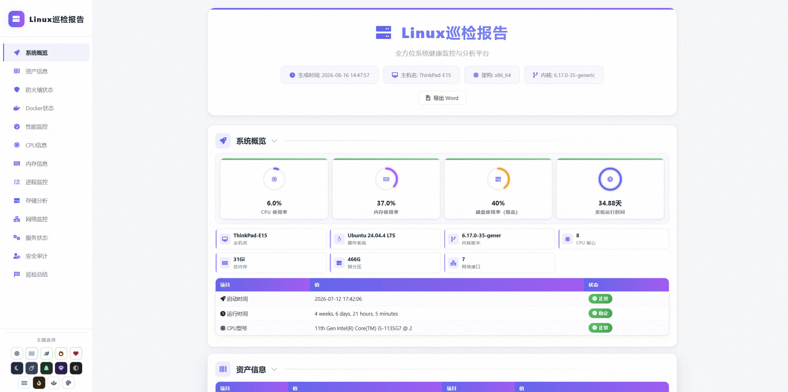

# HostInspection 

HostInspection 是一个基于 Bash 的 Linux 主机巡检脚本。它会自动采集操作系统、硬件资源、进程、存储、网络、防火墙、Docker、系统服务及 SSH 安全配置等信息，并生成一份可交互、可切换主题的 HTML 巡检报告。

当前版本：**v10**

## 主要特点

- 单文件 Bash 脚本，无需部署后端服务
- 自动生成带时间戳的 HTML 报告
- 提供 CPU、内存和磁盘使用率可视化
- 根据巡检结果生成系统健康评分
- 支持 13 种预设主题和自定义主题颜色
- 支持侧边栏导航、滚动定位、章节折叠和表格搜索
- 支持将报告导出为 Word `.doc` 文件
- 提供打印优化与移动端响应式布局
- 对缺失命令和非 root 环境进行兼容处理

## 项目结构

```text
HostInspection/
└── shell/
    └── linux-inspection-v10.sh   # Linux 主机巡检及 HTML 报告生成脚本
```

项目当前的全部功能集中在 `shell/linux-inspection-v10.sh` 中。脚本同时包含：

1. Linux 系统信息采集逻辑；
2. 巡检状态判断与健康评分逻辑；
3. HTML 页面结构；
4. CSS 主题和响应式样式；
5. JavaScript 页面交互及 Word 导出逻辑。

## 巡检内容

### 1. 系统概览

采集并展示：

- 主机名
- 操作系统发行版
- 内核版本
- 系统架构
- CPU 核心数
- 总内存
- 根分区容量
- 网络接口数量
- 系统启动时间与持续运行时间
- CPU 型号

报告顶部通过仪表盘展示以下核心指标：

- CPU 使用率
- 内存使用率
- 所有有效文件系统中的最高磁盘使用率
- 系统运行时长

### 2. 资产信息

优先从 `/sys/class/dmi/id` 读取硬件资产信息，必要时回退到 `dmidecode`，包括：

- 设备制造商及产品型号
- 设备序列号与 UUID
- BIOS 厂商、版本及发布日期
- 主板厂商、型号及序列号
- 物理机、虚拟机或容器环境识别

### 3. 防火墙状态

自动检测以下防火墙工具：

- UFW
- Firewalld
- iptables

报告包括状态概览、防火墙规则和相关服务状态。未检测到防火墙工具或防火墙未运行时，会显示相应警告。

### 4. Docker 状态

当系统中安装了 Docker 时，自动增加 Docker 巡检模块，展示：

- 运行中的容器
- 容器镜像、状态及端口映射
- 容器 CPU 与内存占用
- Docker 镜像列表
- Docker 网络列表
- `docker stats` 资源使用信息

若没有安装 Docker，该模块不会出现在报告中。

### 5. 性能监控

采集以下性能指标：

- CPU 当前使用率
- CPU 核心数、线程数和平均负载
- 总内存、已用内存、可用内存及缓存
- CPU 占用最高的进程
- 内存占用最高的进程

CPU 和内存达到阈值时，报告会自动显示警告或危险状态。

### 6. CPU 信息

展示 CPU 的详细规格和功能特性：

- 型号及厂商
- CPU 插槽数
- 每槽核心数
- 逻辑 CPU 数
- 当前主频及缓存信息
- VT-x/AMD-V 虚拟化支持
- AES-NI 硬件加密支持
- 超线程支持状态
- 系统负载平均值

### 7. 内存信息

展示：

- 物理内存总量、已用、空闲、共享、缓存及可用容量
- Swap 总量、使用量和启用状态
- HugePages 数量及页面大小
- 内存条插槽、容量、类型、频率和厂商信息

内存条详情依赖 root 权限和 `dmidecode`。

### 8. 进程监控

统计：

- 进程总数
- 运行、睡眠、停止及不可中断进程数量
- 僵尸进程数量
- CPU 占用前 10 的进程
- 内存占用前 10 的进程

发现僵尸进程时，会将其标记为危险项并展示对应进程列表。

### 9. 存储分析

包括：

- 文件系统容量和使用率
- 磁盘使用率状态判断
- 分段式使用率进度条
- 块设备及挂载点信息
- Inode 使用情况
- LVM 逻辑卷信息
- 主要文件系统挂载信息

报告内支持按文件系统或挂载点实时搜索。

### 10. 网络监控

包括：

- 网络接口名称
- IP 地址和 MAC 地址
- 接口在线状态
- 网卡速率
- TCP/UDP 监听端口
- 端口关联进程及 PID
- ESTABLISHED、TIME-WAIT、CLOSE-WAIT 和 LISTEN 连接统计
- 已建立连接详情

虚拟接口（如 Docker、CNI、veth、网桥等）离线时仅作为信息展示，物理接口离线则会被标记为危险状态。

### 11. 系统服务

在支持 `systemctl` 的系统中，检查常见服务的运行状态与开机自启状态，包括：

- SSH
- Nginx、Apache
- MySQL、MariaDB、PostgreSQL、MongoDB、Redis
- Docker
- Cron
- rsyslog、systemd-journald
- SNMP、Zabbix Agent、Node Exporter 等

报告中的服务清单是脚本内预定义的固定列表，并非系统全部服务。

### 12. 安全审计

安全巡检内容包括：

- 当前登录用户
- 最近登录记录
- 当前监听端口数量
- 最近一小时的系统错误日志数量
- OpenSSH 版本、运行状态与开机自启状态
- SSH 监听端口
- Root 登录配置
- 密码认证与公钥认证配置
- 最大认证尝试次数
- 空密码配置

若检测到允许 Root 登录、允许密码认证或允许空密码，报告会给出风险提示。

> 本工具提供的是主机状态采集和基础配置检查，不等同于完整的漏洞扫描、基线核查或合规审计工具。

## 健康评分规则

脚本先统计报告中的正常、警告和危险状态，再从 100 分开始扣分：

```text
健康分 = 100 - 警告数量 × 1 - 危险数量 × 10
```

最低分为 0，分级规则如下：

| 分数范围 | 状态 |
|---|---|
| 80～100 | 系统健康 |
| 60～79 | 需要注意 |
| 0～59 | 需要处理 |

资源使用率主要使用以下阈值：

| 使用率 | 状态 |
|---|---|
| 低于 80% | 正常 |
| 80%～89.9% | 警告 |
| 90% 及以上 | 危险 |

健康评分用于快速浏览，不应替代人工分析。部分“未安装”或“未启用”状态也可能计入警告，因此需要结合主机用途判断。

## 运行环境

### 基本要求

- Linux 操作系统
- Bash
- `/proc` 和 `/sys` 文件系统可用
- 建议使用 root 权限运行

脚本会检查以下基础命令：

- `df`
- `free`
- `uptime`
- `ps`
- `ip`

部分扩展功能按需依赖：

- `systemctl`
- `ss`
- `top`
- `docker`
- `ufw`
- `firewall-cmd`
- `iptables`
- `dmidecode`
- `ethtool`
- `lsblk`
- `lvs`
- `journalctl`

缺少可选命令时，脚本通常会跳过对应功能或在报告中显示“不可用”。

### 兼容性说明

- 最适合采用 systemd 的常见 Linux 发行版。
- 非 systemd 系统仍可执行基础巡检，但不会生成“服务状态”等依赖 `systemctl` 的模块。
- Docker 模块仅在检测到 `docker` 命令时生成。
- 部分硬件、端口进程、日志及 SSH 状态信息需要 root 权限。
- 脚本使用 GNU/Linux 常见命令参数，未针对 macOS 或 BSD 系统设计。

## 快速开始

进入项目目录后执行：

```bash
chmod +x shell/linux-inspection-v10.sh
sudo ./shell/linux-inspection-v10.sh
```

也可以直接通过 Bash 运行：

```bash
sudo bash shell/linux-inspection-v10.sh
```

若只需要普通权限能够读取的内容，也可以不使用 `sudo`：

```bash
bash shell/linux-inspection-v10.sh
```

此时终端会提示部分巡检信息可能不完整。

## 输出文件

脚本在**当前执行目录**生成报告，文件名格式为：

```text
system_inspection_YYYYMMDD_HHMMSS.html
```

例如：

```text
system_inspection_20260817_153000.html
```

执行完成后，终端会输出报告路径。如果环境中存在 `xdg-open` 或 `open` 命令，脚本还会尝试自动在浏览器中打开报告。

如果希望报告固定生成到某个目录，应先进入目标目录，再通过脚本绝对路径执行：

```bash
cd /var/reports
sudo bash /path/to/HostInspection/shell/linux-inspection-v10.sh
```

## HTML 报告功能

生成的报告提供以下交互能力：

- 自动构建侧边栏目录
- 当前章节滚动高亮
- 主章节及子章节折叠
- 防火墙和 Docker 信息标签页
- 磁盘、端口和服务表格搜索
- CPU、内存、磁盘及健康分动画
- 返回顶部按钮
- 响应式移动端布局
- 打印前自动展开全部内容
- 浏览器本地保存主题偏好

### 主题

预设主题包括：

1. 浅色
2. 白蓝
3. 护眼绿
4. 暖橙
5. 玫红
6. 暗黑
7. 深空灰
8. 墨绿暗黑
9. 午夜紫
10. 黑白
11. 青蓝
12. 琥珀暗黑
13. 樱花粉

此外还提供颜色选择器，可根据选定颜色动态生成自定义主题。主题配置保存在浏览器的 `localStorage` 中。

### 导出 Word

点击报告顶部的“导出 Word”按钮后，页面会：

1. 展开所有章节和标签页；
2. 将仪表盘、指标卡和进度条转换为表格；
3. 移除不适合文档展示的交互控件；
4. 生成适合 A4 页面排版的 Word HTML 文档；
5. 下载 `.doc` 文件。

导出文件名格式为：

```text
Linux巡检报告_<主机名>_<日期>.doc
```

## 实现流程

脚本总体执行过程分为四个阶段：

```text
检查运行权限和依赖命令
          ↓
采集 CPU、内存、磁盘等基础指标
          ↓
逐模块采集数据并拼装 HTML
          ↓
汇总状态、计算健康分并完成报告
```

### 核心辅助函数

| 函数 | 作用 |
|---|---|
| `check_command` | 检查系统命令是否存在 |
| `compare_float` | 使用 `awk` 比较浮点数 |
| `get_cpu_usage` | 通过 `top` 或 `/proc/stat` 获取 CPU 使用率 |
| `get_memory_usage` | 通过 `free` 计算内存使用率 |
| `get_disk_usage` | 获取有效文件系统中的最高使用率 |
| `get_card_status` | 根据使用率返回正常、警告或危险状态 |
| `add_status_badge` | 生成 HTML 状态标签 |
| `html_escape` | 对命令输出进行 HTML 转义 |
| `add_section` / `end_section` | 生成报告章节结构 |
| `make_circular_progress` | 生成环形进度组件 |

## 注意事项

### 1. 建议使用 root 权限

普通用户可以运行脚本，但下列信息可能不完整：

- DMI 硬件和内存条信息
- 监听端口关联的进程与 PID
- 防火墙完整规则
- Docker 资源信息
- 系统日志
- SSH 服务状态

### 2. 报告可能包含敏感信息

生成的 HTML 可能包含：

- 主机名、IP 地址和 MAC 地址
- 设备序列号及 UUID
- 登录用户名和来源地址
- 监听端口及进程名称
- Docker 镜像、容器和端口映射
- SSH 配置与系统服务状态

请将报告视为敏感运维资料，不要直接上传到公开仓库或发送给无关人员。对外分享前建议进行脱敏。

### 3. 页面图标依赖网络

HTML 报告通过 CDN 加载 Font Awesome：

```text
https://cdnjs.cloudflare.com/ajax/libs/font-awesome/6.0.0/css/all.min.css
```

离线环境中巡检数据和页面主体仍可查看，但图标可能无法显示。如需完全离线使用，可将 Font Awesome 静态资源下载到本地并修改脚本中的引用地址。

### 4. 脚本只执行读取型巡检

脚本主要读取系统状态并生成报告，不会自动修改防火墙、SSH、服务或系统配置。报告中的风险提示需要由运维人员结合业务场景判断和处理。

## 适用场景

- Linux 服务器日常巡检
- 上线前基础环境检查
- 故障排查时快速收集主机状态
- 运维交接与资产信息整理
- 定期生成服务器健康报告
- 小规模主机环境的人工巡检


## 截图示例
生成html报告



